# ITCNE23-SEM-III

## Einleitung
Die Semesterarbeit zielt darauf ab, ein Datenbankkonzept für ein Warehouse Management System (WMS) zu entwickeln und umzusetzen, mit dem Aufträge effizient abgewickelt werden können. Der Fokus liegt dabei auf der Datenmodellierung und dem Datenschema, wobei ausschliesslich der Backend-Teil implementiert wird, während die Frontend-Entwicklung ausgeschlossen ist.

**Datenmodellierung für WMS:** Die Herausforderung besteht darin, ein geeignetes Datenmodell zu entwerfen, das die Anforderungen an Benutzerverwaltung, Kundenverwaltung, Artikelverwaltung, Seriennummernverwaltung und Lieferscheinverwaltung erfüllt. Dabei müssen die Beziehungen zwischen den verschiedenen Entitäten berücksichtigt werden, um eine effiziente Datenverwaltung zu gewährleisten.

**Deployment in AWS mit IaC:** Die Semesterarbeit erfordert die Fähigkeit, das Datenbankkonzept mithilfe von Infrastructure as Code (IaC) in der AWS-Cloud bereitzustellen. Dies erfordert Kenntnisse in der Konfiguration von AWS-Ressourcen und -Diensten sowie in der Automatisierung von Bereitstellungsprozessen mittels Python-Skripten.

**Monitoring mit Prometheus:** Ein weiteres Ziel ist es, die Datenbank mittels Prometheus zu überwachen. Dies erfordert die Implementierung von Monitoring-Metriken, um Einblicke in den Zustand und die Leistung der Datenbank zu erhalten. Die Herausforderung besteht darin, relevante Metriken zu identifizieren und zu implementieren, um potenzielle Probleme frühzeitig zu erkennen und zu beheben.

**Backupstrategie:** Die Entwicklung einer effektiven Backup-Strategie ist ebenfalls ein wichtiger Teil der Problemlösung. Dies beinhaltet die regelmässige Sicherung der Datenbank sowie die Implementierung von Wiederherstellungsmechanismen, um die Integrität und Verfügbarkeit der Daten im Falle eines Datenverlustes zu gewährleisten.

**Lifecycle Management:** Ein weiteres Ziel der Arbeit ist es, das Lifecycle-Management der Datenbank zu beschreiben und zu dokumentieren. Dies beinhaltet die Planung, Bereitstellung, Überwachung, Skalierung und Aktualisierung der Datenbankinstanzen im gesamten Lebenszyklus. 

Zusammenfassend soll die Semesterarbeit das Fachwissen vermitteln, um Datenbankkonzepte in die Praxis umzusetzen. Dies beinhaltet die Entwicklung eines geeigneten Datenmodells, die Bereitstellung der Datenbank in der Cloud, die Überwachung ihrer Leistung und Verfügbarkeit sowie die Implementierung einer zuverlässigen Backupstrategie. Durch diesen praxisorientierten Ansatz möchte ich in der Lage sein, ähnliche Herausforderungen in meiner späteren beruflichen Tätigkeit erfolgreich zu meistern.

### Beispiel
Die Datenbank muss berücksichtigen, dass ein Kunde mehrere Bestellungen haben kann. Ein Auftrag besteht aus einem oder mehreren Artikeln, wobei für einige Artikel die Eingabe der Seriennummer erforderlich ist.
Damit der Auftrag an den Kunden ausgeliefert werden kann, muss er von einem Mitarbeiter bearbeitet werden. Dies beinhaltet die Kommissionierung der Artikel und die Eingabe der Seriennummer.
Ein konkretes Beispiel könnte folgendermassen aussehen:
Mitarbeiter "X" bearbeitet den Auftrag des Kunden "Y". Der Auftrag enthält 2 Positionen mit unterschiedlichen Artikeln. Position 1 enthält 3 Stück des Artikels "xxx" und Position 2 enthält 2 Stück des Artikels "yyy". Der Artikel "yyy" ist seriennummernpflichtig, d.h. bei der Kommissionierung muss die Seriennummer des Artikels eingegeben werden.

### Übersicht

## Projektmanagement
Die für diese Semesterarbeit gewählte Projektmanagementmethode ist Kanban, eine agile Arbeitsmethode, die darauf abzielt, Arbeitsprozesse zu visualisieren und den Arbeitsfluss effizient zu steuern. Diese Entscheidung basiert auf der Flexibilität und Anpassungsfähigkeit, die Kanban bietet.

Um die Semesterarbeit effektiv zu managen, wird sie in mehrere Iterationen (Sprints) unterteilt. Diese Sprints dienen dazu, den Arbeitsfortschritt zu verfolgen, klare Ziele für bestimmte Zeiträume zu setzen und regelmässige Reviews durchzuführen. Die Aufgaben werden priorisiert und in Kanban-Phasen wie "To-Do", "In Progress" und "Done" eingeteilt, um einen klaren Überblick über den Projektstatus zu gewährleisten.

Für das gesamte Projektmanagement wird ein GitHub Project mit der Bezeichnung ITCNE23-SEM-III verwendet. GitHub Project ermöglicht ein integriertes und kollaboratives Management von Tasks, Issues und Milestones. Hier können nicht nur Kanban-Boards erstellt, sondern auch Fortschritte dokumentiert, Diskussionen geführt und notwendige Ressourcen bereitgestellt werden. Diese zentrale Plattform fördert die Zusammenarbeit und erleichtert die Nachverfolgung von Änderungen.

### Kanbanboard
Die Visualisierung der Arbeitsprozesse erfolgt über ein Kanban-Board, das als zentrales Instrument für das Projektmanagement fungiert. Dieses Board bietet nicht nur eine übersichtliche Darstellung aller Aufgaben, sondern zielt auch darauf ab, den Arbeitsfluss zu optimieren und die Gesamteffizienz des Projekts zu steigern.

Durch die konsequente Nutzung dieses Kanban-Boards können Engpässe und Bottlenecks im Arbeitsfluss schnell identifiziert werden, was zu einer effizienten Arbeitsweise führt.

Die effektive Anwendung dieses visuellen Instruments trägt wesentlich zum erfolgreichen Abschluss der Semesterarbeit bei und ermöglicht eine flexible Anpassung an sich verändernde Anforderungen während des gesamten Projektablaufs.

### Roadmap
Die strategische Planung und Steuerung der Sprintarbeit erfolgt anhand einer detaillierten Roadmap, die wichtige Meilensteine enthält. Diese Meilensteine sind auf die einzelnen Sprints abgestimmt und dienen als Leitfaden für die Fortschrittskontrolle und den erfolgreichen Abschluss der Projektphasen.

| Datum | Sprint |
| --- | --- |
| 27.05.2024 | Ergebnis 1. Sprint |
| 17.06.2024 | Ergebnis 2. Sprint |
| 12.07.2024 | Ergebnis 3. Sprint / Abgabe / Präsentation |

### Tasklist
Um die Verwaltung und Organisation der Aufgaben weiter zu optimieren, wird eine Taskliste erstellt. Diese dient dazu, Aufgaben zu erfassen, sie nach verschiedenen Kategorien zu filtern und zu gruppieren. Das Ziel ist, eine bessere Übersichtlichkeit und Strukturierung innerhalb des Projektmanagements zu gewährleisten.

Die Taskliste wird so gestaltet, dass jeder Task mit spezifischen Metadaten versehen werden kann, um eine einfache Zuordnung zu bestimmten Kategorien zu ermöglichen. 

#### Task Kategorien
- Status
- Priority
- Milestones

#### Task Status
Das Kanbanboard wir in 4 Spalten aufgeteilt.
- Todo
- In Progress
- Done
- Backlog

#### Task Labels
Es werden folgende Labels verwendet um die Tasks nach Themen zu gruppieren.
- Doku  --> Task für die Dokumentation
- DB    --> Task für Datenbank
- IaC   --> Task für Infrstructure as Cose
- AWS   --> Task für Amazon Web Services

### SEUSAG
#### Systemgrenze

#### Einflussgrössen

#### Unter- bzw. Teilsysteme 

#### Schnittstellen
| Schnittstelle | 
Element
 | Beschreibung |
|---------------|---------|-------------|
| S1 | xxx| xxx |
| S2 | xxx| xxx |
| S3 | xxx| xxx |

#### Analyse der Unter- bzw. Teilsysteme

##### XXX

##### XXX

##### Entwicklungsumgebung
Distributor ID: Ubuntu
Description:    Ubuntu 22.04.3 LTS
Release:	    22.04
Codename:	    jammy

#### Gemeinsamkeiten
- xxx
- xxx
- xxx

### Ziele SMART
- xxx
- xxx
- xxx

### Risikoanalyse
Um mögliche Risiken zu identifizieren, die den Erfolg der Semesterarbeit gefährden könnten, wird eine Risikoanalyse durchgeführt. Ziel der Risikoanalyse ist es, Risiken zu identifizieren und zu bewerten, um geeignete Massnahmen zu deren Bewältigung zu ergreifen.

https://www.orghandbuch.de/Webs/OHB/DE/OrganisationshandbuchNEU/4_MethodenUndTechniken/Methoden_A_bis_Z/Risikoanalyse/risikoanalyse_node.html#doc21101590bodyText2

#### Risikoidentifikation

#####     Kopfstandtechnik
    Bei der Kopfstandtechnik wird die eigentliche Kernfrage der Risikoidentifikation „umgekehrt“. Mit der daraus resultierenden ungewöhnlichen Aufgabenstellung sollen die Teilnehmenden kreativ animiert werden, um auch unerwartete und unkonventionelle Überlegungen als Ergebnis zu erhalten. Die einzelnen Schritte sind

    Schritt 1: Die ursprüngliche Aufgabenstellung, z. B.: „Welche zukünftigen Ereignisse können unseren Erfolg gefährden?“ wird umgekehrt und somit unerwartet auf den Kopf gestellt, z. B.: „Was müssen wir tun, um unseren Erfolg am wirksamsten zu verhindern?“:

    Schritt 2: Die Teilnehmenden entwickeln Lösungen für die umgekehrte Fragestellung.

    Schritt 3: Die zur umgekehrten Fragestellung entwickelten Lösungsansätze werden wiederrum umgekehrt, um sie für die ursprüngliche Aufgabenstellung als Lösungsansatz zu verwenden.[6]

Vorteile	Nachteile

    Fördern alternativen Denkens,
    hohe Akzeptanz in der Praxis durch „spielerischen“ Ansatz,
    empirische Daten nicht erforderlich,
    niedriger zeitlicher Aufwand,

    unkonventionelle Ergebnisse.

#### Risikobewertung

### Sprints
Am Ende eines Sprints findet eine Reflexion statt, die ein wesentlicher Bestandteil des agilen Projektmanagements ist. In diesem Prozess werden nicht nur die erreichten Fortschritte betrachtet, sondern auch Herausforderungen, Erfahrungen und mögliche Verbesserungspotenziale identifiziert. Ein zentrales Element dieser Reflexion ist die grafische Erfassung des Status der Taskliste, die dazu dient, einen klaren Überblick über den Verlauf des Sprints zu erhalten.

## Sprint 1 - dd.mm.yy
xxx-picture

### Reflektion

**xxx-Thema**-
- https://gist.github.com/philip-gai/9c801bdff0ec4c1954f18217dc808476

## Sprint 2 - dd.mm.yy
xxx-picture

### Reflektion

**xxx-Thema**

## Sprint 3 - dd.mm.yy
xxx-picture

### Reflektion

**xxx-Thema**

**Präsentation Semesterarbeit**
Für die Präsentation meiner Semesterarbeit habe ich mich für Google Docs entschieden. Um die zeitliche Begrenzung von ca. 10 Minuten einzuhalten, habe ich mich darauf konzentriert, die wichtigsten Informationen auf 5 Folien zu komprimieren. Ziel ist es, dass die Zuhörer den Inhalt meiner Semesterarbeit verstehen und durch die Live-Demo einen fundierten Einblick erhalten.

**Fazit der Semesterarbeit**
Das Fazit der Semesterabeit soll ein Zusammenzug der drei Spints sein und wir in einem seperaten Punkt beschrieben ([Fazit](#fazit)). 

## Installation

### XXX

### XXX

### XXX

## Testing

### Testprotokoll
Das Testprotokoll soll dazu beitragen, die Effizienz, Qualität und Zuverlässigkeit der Semesterarbeit zu verbessern, indem es einen strukturierten und nachvollziehbaren Testprozess ermöglicht.

| Fall | Beschreibung | Test Step | Erwartetes Resultat | Status | Screen |
| ---     | ---     | ---   | ---     | ---   |  ---   |
| TC-01 | xxx | xxx | xxx | xxx | [TC-xx](./xxx.png) |
| TC-02 | xxx | xxx | xxx | xxx | [TC-xx](./xxx.png) |
| TC-03 | xxx | xxx | xxx | xxx | [TC-xx](./xxx.png) |
| TC-04 | xxx | xxx | xxx | xxx | [TC-xx](./xxx.png) |

## Fazit Semesterarbeit
Semesterarbeit TBZ Cloud-native Engineer, Klasse ITCNE23, 3. Semester.

