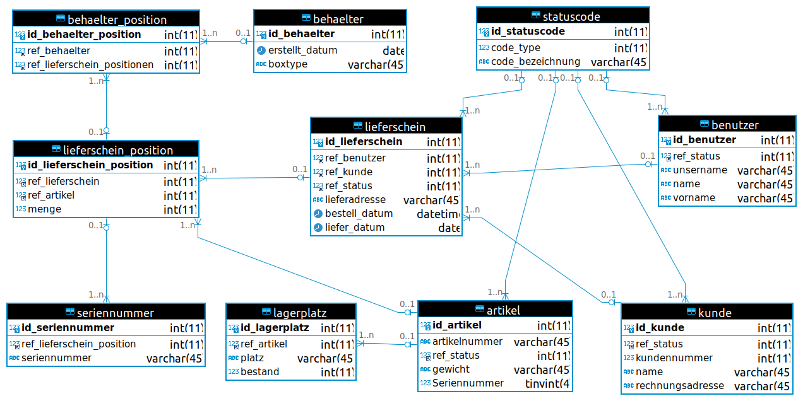
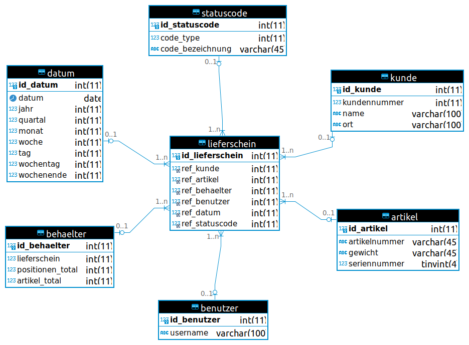
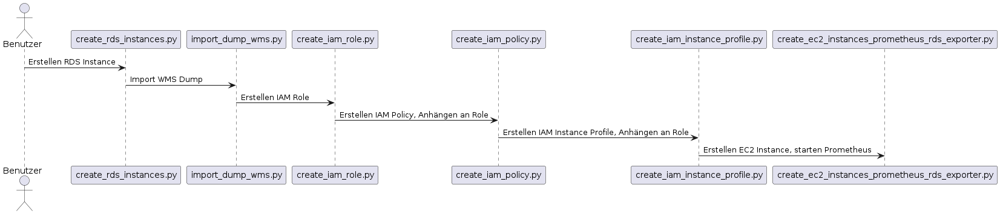

# ITCNE23-SEM-III - WMS Datenbankkonzept inklusive  AWS-Deployment

## Einleitung
Diese Semesterarbeit konzentriert sich auf die Entwicklung eines Datenbankkonzepts für ein Warehouse Management System (WMS). Der Fokus liegt auf der Datenmodellierung und dem Datenschema, wobei nur der Backend-Teil implementiert wird. Das Datenbankschema soll mittels boto3 auf AWS deployed und die Datenbankinstanz mittels Prometheus überwacht werden.

**Datenmodellierung für WMS:** Die Herausforderung besteht darin, ein geeignetes Datenmodell zu entwerfen, das die Anforderungen an Benutzerverwaltung, Kundenverwaltung, Artikelverwaltung, Seriennummernverwaltung und Lieferscheinverwaltung erfüllt. Dabei müssen die Beziehungen zwischen den verschiedenen Entitäten berücksichtigt werden, um eine effiziente Datenverwaltung zu gewährleisten.

Auf basis des WMS soll ein Datenmodel für ein Warehouse System entworfen werden.

**Deployment in AWS mit IaC:** Die Semesterarbeit erfordert die Fähigkeit, das Datenbankkonzept mithilfe von Infrastructure as Code (IaC) in der AWS-Cloud bereitzustellen. Dies erfordert Kenntnisse in der Konfiguration von AWS-Ressourcen und -Diensten sowie in der Automatisierung von Bereitstellungsprozessen mittels Python-Skripten.

**Monitoring mit Prometheus:** Ein weiteres Ziel ist es, die Datenbank mittels Prometheus zu überwachen. Dies erfordert die Implementierung von Monitoring-Metriken, um Einblicke in den Zustand und die Leistung der Datenbank zu erhalten. Die Herausforderung besteht darin, relevante Metriken zu identifizieren und zu implementieren, um potenzielle Probleme frühzeitig zu erkennen und zu beheben.

**Backup-Strategie:** Die Entwicklung einer effektiven Backup-Strategie ist ebenfalls ein wichtiger Teil der Problemlösung. Dies beinhaltet die regelmässige Sicherung der Datenbank sowie die Implementierung von Wiederherstellungsmechanismen, um die Integrität und Verfügbarkeit der Daten im Falle eines Datenverlustes zu gewährleisten.

**Lifecycle Management:** Ein weiteres Ziel der Arbeit ist es, das Lifecycle-Management der Datenbank zu beschreiben und zu dokumentieren. Dies beinhaltet die Planung, Bereitstellung, Überwachung, Skalierung und Aktualisierung der Datenbankinstanzen im gesamten Lebenszyklus. 

Zusammenfassend soll die Semesterarbeit das Fachwissen vermitteln, um Datenbankkonzepte in die Praxis umzusetzen. Dies beinhaltet die Entwicklung eines geeigneten Datenmodells, die Bereitstellung der Datenbank in der Cloud, die Überwachung ihrer Leistung und Verfügbarkeit sowie die Implementierung einer zuverlässigen Backup-Strategie. Durch diesen praxisorientierten Ansatz möchte ich in der Lage sein, ähnliche Herausforderungen in meiner späteren beruflichen Tätigkeit erfolgreich zu meistern.

### Beispiel WMS Anforderung
Die Datenbank muss berücksichtigen, dass ein Kunde mehrere Bestellungen haben kann. Ein Auftrag besteht aus einem oder mehreren Artikeln, wobei für einige Artikel die Eingabe der Seriennummer erforderlich ist.
Damit der Auftrag an den Kunden ausgeliefert werden kann, muss er von einem Mitarbeiter bearbeitet werden. Dies beinhaltet die Kommissionierung der Artikel und die Eingabe der Seriennummer falls notwendig.

Ein konkretes Beispiel könnte wie folgt aussehen:
Mitarbeiter "X" bearbeitet den Auftrag des Kunden "Y". Der Auftrag enthält 2 Positionen mit unterschiedlichen Artikeln. Position 1 enthält 3 Stück des Artikels "xxx" und Position 2 enthält 2 Stück des Artikels "yyy". Der Artikel "yyy" ist seriennummerpflichtig, d.h. bei der Kommissionierung muss die Seriennummer des Artikels eingegeben werden. Die Artikel werden in einen Versandbehälter gelegt und dem Spediteur übergeben, der die Artikel an den Kunden liefert.

#### Beispiel Abwicklung Bestellung
Diese BPMN beschreibt den groben Ablauf der Auftragsabwicklung. Der Prozess Kunde/Spediteur ist nicht Bestandteil dieser Semesterarbeit und wurde daher nicht modelliert.


### Übersicht Semesterarbeit


## Projektmanagement
Die für diese Semesterarbeit gewählte Projektmanagementmethode ist Kanban, eine agile Arbeitsmethode, die darauf abzielt, Arbeitsprozesse zu visualisieren und den Arbeitsfluss effizient zu steuern. Diese Entscheidung basiert auf der Flexibilität und Anpassungsfähigkeit, die Kanban bietet.

Um die Semesterarbeit effektiv zu managen, wird sie in mehrere Iterationen (Sprints) unterteilt. Diese Sprints dienen dazu, den Arbeitsfortschritt zu verfolgen, klare Ziele für bestimmte Zeiträume zu setzen und regelmässige Reviews durchzuführen. Die Aufgaben werden priorisiert und in Kanban-Phasen wie "To-Do", "In Progress" und "Done" eingeteilt, um einen klaren Überblick über den Projektstatus zu gewährleisten. 

Für das gesamte Projektmanagement wird ein GitHub Project mit der Bezeichnung ITCNE23-SEM-III verwendet. GitHub Project ermöglicht ein integriertes und kollaboratives Management von Tasks, Issues und Milestones. Hier können nicht nur Kanban-Boards erstellt, sondern auch Fortschritte dokumentiert, Diskussionen geführt und notwendige Ressourcen bereitgestellt werden. Diese zentrale Plattform fördert die Zusammenarbeit und erleichtert die Nachverfolgung von Änderungen.

### Kanbanboard
Die Visualisierung der Arbeitsprozesse erfolgt über ein Kanban-Board, das als zentrales Instrument für das Projektmanagement fungiert. Dieses Board bietet nicht nur eine übersichtliche Darstellung aller Aufgaben, sondern zielt auch darauf ab, den Arbeitsfluss zu optimieren und die Gesamteffizienz des Projekts zu steigern.

Durch die konsequente Nutzung dieses Kanban-Boards können Engpässe und Bottlenecks im Arbeitsfluss schnell identifiziert werden, was zu einer effizienten Arbeitsweise führt.

Die effektive Anwendung dieses visuellen Instruments trägt wesentlich zum erfolgreichen Abschluss der Semesterarbeit bei und ermöglicht eine flexible Anpassung an sich verändernde Anforderungen während des gesamten Projektablaufs.

### Roadmap
Die strategische Planung und Steuerung der Sprints erfolgt anhand einer detaillierten Roadmap, die wichtige Meilensteine enthält. Diese Meilensteine sind auf die einzelnen Sprints abgestimmt und dienen als Leitfaden für die Fortschrittskontrolle und den erfolgreichen Abschluss der Projektphasen.

| Datum | Sprint |
| --- | --- |
| 27.05.2024 | Ergebnis 1. Sprint |
| 17.06.2024 | Ergebnis 2. Sprint |
| 12.07.2024 | Ergebnis 3. Sprint / Abgabe / Präsentation |

### Taskliste
Um die Verwaltung und Organisation der Aufgaben weiter zu optimieren, wird eine Taskliste erstellt. Diese dient dazu, Aufgaben zu erfassen, sie nach verschiedenen Kategorien zu filtern und zu gruppieren. Das Ziel ist, eine bessere Übersichtlichkeit und Strukturierung innerhalb des Projektmanagements zu gewährleisten.

Die Taskliste wird so gestaltet, dass jeder Task mit spezifischen Metadaten versehen werden kann, um eine einfache Zuordnung zu bestimmten Kategorien zu ermöglichen. 

#### Task Kategorien
- Status
- Priority
- Milestones

#### Task Status
Das Kanbanboard wir in 4 Spalten aufgeteilt.
- Todo
- In Progress
- Done
- Backlog

#### Task Labels
Es werden folgende Labels verwendet um die Tasks nach Themen zu gruppieren.
- Doku  --> Task für die Dokumentation
- DB    --> Task für Datenbank
- IaC   --> Task für Infrastructure as Code
- AWS   --> Task für Amazon Web Services

### Stakeholder-Analyse
| Name | Rolle | Interesse | Einstellung | Einfluss |
|---------|---------|---------|---------|---------|
| Roger Blum  | Konzept / Projektmanagement / Entwicklung / Dokumentation / Präsentation  | Termingerechte Umsetzung, Erfüllung der Anforderungen  | Hoch | Kritisch | Optimistisch |
| Philipp Rohr  | Beratung Projektmanagement  | Projektkoordination und Erfolg | Mittel | Unterstützend |
| Thomas Kählin | Beratung Technische Umsetzung  | Technische Umsetzung Datenbank | Mittel | Unterstützend |
| Marcel Bernet | Kursleiter ITCNE-23  | Ausbildungserfolg der Studierenden | Niedrig | Neutral |

**Roger Blum**
Kategorie: Schlüsselspieler
Strategie: Regelmässige Updates, Kommunikation mit Dozenten, um sicherzustellen, dass die Anforderungen erfüllt werden und alle Projektschritte termingerecht umgesetzt werden. Auf kritischen Rückmeldungen eingehen und Lösungen anbieten.

**Thomas Kählin**
Kategorie: Unterstützer
Strategie: Unterstützung bei der technischen Umsetzung, Sicherstellung, dass er über alle technischen Anforderungen und Änderungen informiert ist.

**Philipp Rohr**
Kategorie: Unterstützer
Strategie: Einbindung in das Projektmanagement, klare Kommunikation der Projektziele und Fortschritte. Meetings zur Fortschrittsüberprüfung und zur Sicherstellung der kontinuierlichen Unterstützung.

**Marcel Bernet**
Kategorie: Beobachter
Strategie: Gelegentliche Updates und Informationen über den Projektfortschritt mit den Dozenten, um sicherzustellen, dass er über den Ausbildungsfortschritt informiert bleibt. Seine neutrale Einstellung durch Transparenz und Offenheit beibehalten.

### SEUSAG
#### Systemgrenze


#### Schnittstellen
| Schnittstelle | <div style="width:175px">Element</div> | Beschreibung |
|---------------|---------|-------------|
| S1 | AWS CLI / Phyton (boto3) | Um Datenbankressourcen in der AWS Cloud bereitzustellen, wird die AWS CLI / boto3 verwendet. |
| S2 | Phyton (boto3) / AWS Services | Mit Hilfe von boto3 wird der AWS-Datenbankservice entsprechend den Anforderungen konfiguriert. |
| S3 | AWS Services / MariaDB | Die MariaDB soll auf dem AWS RDS (Amazon Relational Database Service) zur Verfügung gestellt werden. |
| S4 | MariaDB / Entwickler | Der Entwickler sollte die Möglichkeit haben, auf die MariaDB zuzugreifen, um deren Ressourcen zu überprüfen bzw. um den Status zu überprüfen. |

#### Einflussgrössen


| Einflüsse | <div style="width:175px">Element</div> | Beschreibung |
|---------------|---------|-------------|
| E1 | Cloud Provider | Der Cloud Provider beeinflusst die Verfügbarkeit und Zuverlässigkeit der bereitgestellten Dienste. Ein zuverlässiger Provider mit einer stabilen Infrastruktur minimiert das Risiko von Ausfallzeiten und Unterbrechungen, die sich negativ auf die Semesterarbeit auswirken könnte. Die Möglichkeit der schnellen Skalierung von Ressourcen ist ein wesentlicher Vorteil von AWS, weshalb dieser Provider für die Semesterarbeit ausgewählt wurde. |
| E2 | Entwickler | Die Fähigkeit des Entwicklers, sich selbst zu organisieren, Prioritäten zu setzen und eigenverantwortlich zu arbeiten, beeinflusst seine Effizienz und die Qualität der Semesterarbeit. Dazu gehören auch die technischen Fähigkeiten und die Erfahrung des Entwicklers.  |
| E3 | Zeit  | Der Abgabetermin für die Semesterarbeit legt den Zeitrahmen fest, in dem alle Projektaktivitäten abgeschlossen sein müssen. Die zeitliche Begrenzung erfordert eine sorgfältige Priorisierung der Aufgaben und Aktivitäten. Kritische Aufgaben müssen identifiziert werden, um sicherzustellen, dass sie rechtzeitig abgeschlossen werden, während weniger wichtige Aufgaben zurückgestellt werden können. |
| E4 | Dozent | Der Dozent legt die Richtlinien und Erwartungen für die Semesterarbeit fest, einschliesslich des Umfangs, der Struktur, der Bewertungskriterien und der Abgabefristen. Das Einholen von Feedback und die Berücksichtigung der Bewertungskriterien des Dozenten haben hohe Priorität, um sicherzustellen, dass die Semesterarbeit den Anforderungen entspricht und erfolgreich abgeschlossen wird. |
| E5 | MySQL | MySQL ist ein relationales Datenbankmanagementsystem, das zur Speicherung und Verwaltung strukturierter Daten verwendet wird. In dieser Semesterarbeit wird MySQL als Datenbank für die Speicherung der Daten des Warehouse Management Systems (WMS) verwendet. |

#### Unter- bzw. Teilsysteme 


#### Analyse Teilsystem AWS Provider

##### AWS RDS
Amazon RDS (Relational Database Service) ist ein Managed Service von Amazon Web Services (AWS), der es ermöglicht, relationale Datenbanken in der Cloud zu erstellen, zu betreiben und zu skalieren, ohne sich um die zugrunde liegende Infrastruktur kümmern zu müssen. Mit Amazon RDS können Benutzer Datenbankinstanzen schnell bereitstellen, verwalten und skalieren.
Aus diesem Grund soll in dieser Semesterarbeit AWS RDS für den Betrieb von MariaDB verwendet werden.

##### Prometheus
Prometheus ist ein Open Source Überwachungs- und Alarmsystem. Es wurde entwickelt, um eine skalierbare und zuverlässige Lösung für die Überwachung von verteilten Systemen und Anwendungen bereitzustellen. Prometheus ermöglicht es, Metriken von verschiedenen Systemkomponenten zu sammeln, zu speichern, zu aggregieren, zu visualisieren und darauf basierende Alarme zu erstellen. Es soll in dieser Semesterarbeit für das Monitoring von MariaDB verwendet werden.

#### Analyse Teilsystem Entwicklungsumgebung
Eine gut konfigurierte Entwicklungsumgebung kann die Effizienz der Entwicklung erheblich verbessern. Eine reibungslose Integration von Entwicklungstools, eine gute Performance und eine benutzerfreundliche Benutzeroberfläche ermöglichen, sich auf das Wesentliche zu konzentrieren: die Entwicklung der Arbeit.
Die Auswahl der richtigen Werkzeuge und Funktionen in der Entwicklungsumgebung kann den Entwicklungsprozess erheblich unterstützen.
Das folgende physikalische Gerät mit dem folgenden Betriebssystem wird für die Semesterarbeit verwendet.

- Notebook:       DELL XPS
- Description:    Ubuntu 22.04.3 LTS

##### Analyse Untersysteme Entwicklungsumgebung
###### AWS CLI
AWS CLI (Amazon Web Services Command Line Interface) ist ein von Amazon Web Services bereitgestelltes Befehlszeilen-Tool zur Verwaltung von AWS-Ressourcen und zur Interaktion mit AWS-Diensten. Mit AWS CLI können Entwickler und Systemadministratoren AWS-Ressourcen über die Kommandozeile verwalten und automatisieren. 

###### boto3
boto3 ist das offizielle Software Development Kit (SDK) von AWS für die Python-Programmiersprache. Es bietet eine Sammlung von Python-Bibliotheken und Modulen, die es Entwicklern ermöglichen, auf die AWS-Dienste zuzugreifen und mit ihnen zu interagieren.
boto3 soll für die Konfiguration / Deployment von MariaDB in AWS RDS verwendet werden.

###### dBeaver
DBeaver ist eine Open-Source-Datenbankverwaltungssoftware, die für eine Vielzahl von Zwecken und Anwendungsfälle verwendet werden kann.
DBeaver soll verwendet werden, um die MariaDB Datenbank zu verwalten und Datenbankabfragen durchzuführen.

###### MySQL Workbench
MySQL Workbench ist eine visuelle integrierte Entwicklungsumgebung (IDE) für MySQL-Datenbanken. Sie bietet eine Vielzahl von Werkzeugen und Funktionen, um MySQL-Datenbanken effizient zu entwerfen, zu entwickeln, zu verwalten und zu überwachen. 
Es soll in dieser Semesterarbeit für den Entwurf des ERD verwendet werden.


#### Gemeinsamkeiten
- MySQL (Relationale Datenbanken)
- AWS Schnittstellen

### Ziele SMART
#### WMS
Ausarbeitung einer WMS Demo Konzept, welches anschliessend in ein Data Warehouse - Star Schema umgewandelt wird.
- Erstellung ERD für Warehouse Management System (WMS)
- Erstellung ERD für Data Warehouse (DWH)

#### Python (boto3) / IaC
Mittels Python (boto3) soll die WMS Datenbank auf AWS automatisiert erstellt werden.
Dazu wird ein Python Skripts erstellt, welche die folgenden Punkte abdeckt:
- Anlegen der MariaDB Instance auf AWS RDS
- Anlegen der MariaDB Tabellen und deren Abhängigkeiten auf der MariaDB Instances 

#### Prometheus
Einrichtung einer Überwachungslösung auf Basis von Prometheus, um die Leistung und Verfügbarkeit der WMS Datenbank sicherzustellen.
Es soll eine Prometheus Instanz zur Verfügung gestellt werden, welche die Metrics der WMS Datenbank beinhaltet. Diese sollte mindestens folgende Punkte beinhalten:
- Uptime der Datenbank

#### Lifecyclemanagement WMS
Das Lifecyclemanagement soll mit folgenden Punkten dokumentiert werden. 
- Installation / Konfiguration, 
- Überwachung, 
- Skalierung, 
- Sicherung / Wiederherstellung

### Risikoanalyse
Um mögliche Risiken zu identifizieren, die den Erfolg der Semesterarbeit gefährden könnten, wird eine Risikoanalyse durchgeführt. Ziel der Risikoanalyse ist es, Risiken zu identifizieren und zu bewerten, um geeignete Massnahmen zu deren Bewältigung zu ergreifen.

#### Kopfstandtechnik
Für die Risikoanalyse in dieser Semesterarbeit wird die Kopfstandtechnik angewendet. Bei der Kopfstandtechnik wird die eigentliche Kernfrage der Risikoidentifikation „auf den Kopf gestellt“. Die sich daraus ergebende ungewöhnliche Aufgabenstellung soll die Kreativität anregen, um auch unerwartete und unkonventionelle Überlegungen als Ergebnis zu erhalten.

##### Umgekehrte Frage
Wie kann man sicherstellen, dass die Umsetzung der Semesterarbeit scheitert?
Gesammelte Ideen:
- Unklare Anforderungen und Ziel
- Schlechte Kommunikation Studierende / Dozenten
- Nicht einhalten von Deadlines 
- Fehlende Dokumentation
- Unzureichende Testabdeckung
- Übermässige Komplexität in der Architektur.

##### Identifizierte Risiken
- Schlechte Kommunikation Studierende / Dozenten
- Nicht einhalten von Deadlines 
- Fehlende Dokumentation
- Unzureichende Testabdeckung
- Übermässige Komplexität in der Architektur

##### Risikomatrix
|<div style="width:175px">Risiko</div>| <div style="width:175px">Wahrscheinlichkeit</div> | <div style="width:175px">Auswirkung</div> | <div style="width:175px">Bewertung (W * A)</div> | <div style="width:175px">Gegenmassnahme</div> |
|---------------|---------------|---------------|---------------|---------------|
| Schlechte Kommunikation Studierende / Dozenten:<br><br>Verzögerungen und Fehler durch mangelnde Kommunikation und Zusammenarbeit. | Hoch | Mittel | 3*2 = 6 | Regelmässige Meetings, Kommunikationskanal MS Teams Channel für Semesterarbeit. |
| Nicht einhalten von Deadlines:<br><br>Verzögerungen, Semesterarbeit kann nicht termingerecht fertiggestellt werden. | Mittel | Hoch | 2*3 = 6 | Realistische Planung und kontinuierliches Monitoring des Fortschritts (Roadmap / Sprints). |
| Fehlende Dokumentation:<br><br>Wissensverlust und Schwierigkeiten bei der Wartung und Weiterentwicklung. | Mittel | Hoch | 2*3 = 6 | Erstellung und Pflege umfassender Dokumentation für Entwickler und Endbenutzer. |
| Fehler im Produkt, die erst nach dem Abschlusstermin der Semesterarbeit entdeckt werden. | Mittel | Hock | 2*3 = 6 | Umfassende Test-Cases erstellen. Fortlaufend Testen. |
| Übermässige Komplexität in der Architektur<br><br>Erhöhter Entwicklungsaufwand sowie Fehleranfälligkeit. | Niedrig | Mittel | 1*2 = 3 | Verwendung bewährter Architekturprinzipien un regelmässige Architekturbewertungen. |


Die Farben in der Heatmap repräsentieren die Bewertungsstufen (Wahrscheinlichkeit * Auswirkung), wobei eine höhere Bewertung auf ein höheres Risiko hinweist. Die Risiken mit den höchsten Bewertungen wurden mit geeigneten Gegenmassnahmen adressiert, um deren Auswirkungen zu minimieren.

### Sekundärdatenanalyse Datenbank Backup
Wie effektiv und zuverlässig sind die Backup- und Wiederherstellungsmechanismen von Amazon RDS.

#### Ziele
Bewertung der Zuverlässigkeit und Effizienz von Amazon RDS Backup-Mechanismen.

#### Datenquellen
##### AWS Documentation
Offizielle AWS-Dokumentation und Whitepapers über RDS Backups und Snapshots.

##### Technische Blogs und Fachartikel
**Vorteile**
AWS RDS erlaubt die einfache und effiziente Bereitstellung von Datenbanken mit hoher Ausfallsicherheit, Skalierbarkeit und Sicherheit, ohne dass eine Serververwaltung notwendig ist. Mit RDS können neue Datenbanken mühelos erstellt, Replikate in einer Multi-Availability Zone angelegt und Backups durchgeführt werden.
Für die Einrichtung der Datenbank sind nur minimale Kenntnisse oder Zeit erforderlich. Alles, was Sie brauchen, ist im Grunde vorhanden. Die Dokumentation ist fantastisch.

**Nachteile**
Wenn Sie sich mit RDS nicht gut auskennen, können Sie keine effektiven Fehlertests durchführen, wenn ein Problem auftritt.
Den zugewiesenen Speicherplatz in Amazon RDS können Sie nur erhöhen, aber nicht reduzieren.

#### Ergebnisse
##### Zuverlässigkeit und Effizienz
Amazon RDS bietet automatische tägliche Backups und manuelle Snapshots, die als zuverlässig und einfach zu handhaben bewertet werden.
Im Vergleich zu herkömmlichen On-Premise-Systemen reduziert RDS die manuelle Arbeit und das Risiko von Backup-Fehlern erheblich.

##### Benutzerzufriedenheit
Nutzerberichte zeigen eine hohe Zufriedenheit mit der Zuverlässigkeit und Benutzerfreundlichkeit der RDS-Backups.
Einige Nutzer bemängeln die zusätzlichen Kosten für grosse Datenvolumen und die Komplexität bei der Wiederherstellung sehr grosser Datenbanken.

##### Vergleich mit anderen Systemen
In Benchmarks zeigt RDS eine ähnliche oder bessere Performance bei Backups im Vergleich zu anderen Cloud-Anbietern wie Google Cloud SQL und Microsoft Azure SQL Database.
On-Premise-Systeme benötigen oft mehr administrative Ressourcen und sind anfälliger für menschliche Fehler.

#### Zusammenfassung
Die Sekundärdatenanalyse zeigt, dass Amazon RDS eine zuverlässige und effiziente Lösung für Datenbankbackups bietet. Die Kombination aus automatischen Backups, manuellen Snapshots und wettbewerbsfähigen Kosten macht RDS zu einer attraktiven Option für viele Unternehmen. Trotz einiger Nachteile bei grossen Datenmengen überwiegen die Vorteile, insbesondere im Vergleich zu traditionellen On-Premise-Lösungen.

#### Quellenangaben
- [AWS RDS Documentation](https://docs.aws.amazon.com/rds/)
- [opstree](https://opstree.com/blog/2023/12/19/mastering-aws-rds-backups-navigating-encryption-challenges-with-aws-key-management-service-kms/)
- [Computerweekly](https://www.computerweekly.com/de/tipp/Vergleich-Cloud-Datenbanken-AWS-Microsoft-Google-Oracle)
- [Softwareadvice](https://www.softwareadvice.ch/reviews/425208/amazon-rds)
- [Capterra](https://www.capterra.ch/reviews/192201/amazon-rds)
- [Linkedin](https://www.linkedin.com/pulse/how-ensure-aws-rds-database-backups-remain-usable-steve-kinsman)

#### Entscheidung
Basierend auf den gesammelten Informationen und den Tests der AWS-Standard-Backups sowie der manuellen Snapshots habe ich folgende Backup-Strategie gewählt:

- Automatisiertes Backup beim Anlegen der MariaDB-Instanzen (Standardfunktion von AWS)
- Tägliches automatisiertes Backup der MariaDB-Instanzen (Standardfunktion von AWS)
- Skript zur Erstellung manueller Snapshots (boto3)
- Skript zur Wiederherstellung des letzten manuellen Snapshots (boto3)
- Skript für Point in Time Restore (boto3)

Das Standard-Backup von AWS wird automatisch beim Anlegen der Instanzen erstellt und täglich wiederholt. Dabei besteht die Möglichkeit, ein bestimmtes Zeitfenster für die Backups festzulegen, auf das ich jedoch verzichtet habe. 
Die automatisierten Backups haben den Vorteil, dass keine zusätzliche Konfiguration erforderlich ist, es sei denn, sie sollen deaktiviert werden. Da sie zum AWS-Standard gehören, entsteht kein zusätzlicher Aufwand. Auch die Wiederherstellung ist einfach und kann schnell über die AWS-Konsole durchgeführt werden.

Ich habe mich für manuelle Snapshots entschieden, da es Situationen geben kann (z.B. Releases oder Fehleranalysen), in denen kurzfristig ein Snapshot erforderlich ist. Diese Anforderung lässt sich ebenfalls einfach und schnell mit boto3 umsetzen.

Es hat mich überrascht, wie einfach und zuverlässig die AWS-Backups funktionieren.

Folgende Backup Scripts wurden erstellt:
- 
- 
- 
- 
- 

## Umsetzung
### Installation
#### Python
Für die Semesterarbeit wird die vorinstallierte Python Version 3.10.12 von Ubuntu 22.04 verwendet.
Es ist keine zusätzliche Installation notwendig.

[python.org](https://wiki.python.org/moin/BeginnersGuide/Download)

Folgende Packages werden zusätzlich benötigt:
- [pymysql](https://pypi.org/project/pymysql/) 
- [os](https://docs.python.org/3/library/os.html)
- [configparser](https://docs.python.org/3/library/configparser.html#)

##### Boto3
Boto3 wurde gemäss folgender Anleitung installiert (Version 1.34.46).

[Install Boto3](https://boto3.amazonaws.com/v1/documentation/api/latest/guide/quickstart.html#installation)


#### AWS CLI
AWS CLI wurde gemäss der offiziellen AWS Linux Installationsanleitung installiert (Version 2.15.22).

[Install AWS CLI](https://docs.aws.amazon.com/cli/latest/userguide/getting-started-install.html#cliv2-linux-install)

[python.org](https://wiki.python.org/moin/BeginnersGuide/Download)

#### Docker / Podman
Für das lokale Testing wird Docker / Podman verwendet.

[Docker](https://docs.docker.com/engine/install/ubuntu/)
[Podman](https://podman.io/docs/installation)

#### MariaDB
Für das lokale Testing wird das offizielle DockerHub Image von Maria DB verwendet.

[Docker hub - MariaDB](https://hub.docker.com/_/mariadb)

Der Container wird mit folgendem Compose File erstellt:

[MariaDB Podman Compose](./mysql/compose.yml)

Start Container
```
podman compose up -d
```

##### MariaDB-Client
Für das Testen der Verbindung zur AWS RDS MariaDB Instanz wurde MariaDB-Client gemäss AWS Dokumentation installiert.

[MariaDB-Client](https://docs.aws.amazon.com/de_de/AmazonRDS/latest/UserGuide/USER_ConnectToMariaDBInstance.html)

```
# Installation
sudo apt install mariadb-client

# Verbindung
mysql -h "Endpoint-URL" -P 3306 -u "Username" -p

```

#### MySQL Workbench
Die Installation von MySQL Workbench erfolgte gemäss der offiziellen Anleitung der MySQL Community für Linux (Version 8.0.36)

[Install MySQL](https://dev.mysql.com/doc/workbench/en/wb-installing-linux.html#wb-installing-linux-requirements)

```
sudo apt-get install mysql-workbench-community
```

#### dBeaver
Die Installation von dBeaver erfolgte gemäss der offiziellen Anleitung der DBeaver Community für Linux(Version 23.0.5).

[DBeaver Community](https://dbeaver.io/download/)

#### Visual Code Studio
Die Installation von Visual Code Studio erfolgte gemäss der offiziellen Anleitung von Visual Studio Code für Linux (Version 1.89.1)

[Install Visualstudio](https://code.visualstudio.com/docs/setup/linux)

#### Draw.io
Die Installation von Draw.io erfolgte gemäss der offiziellen Anleitung von Snapcraft (Version 24.4.0).

[Install Draw.io](https://snapcraft.io/install/drawio/ubuntu)

#### BPMN
Für BPMN wird die online Version verwendet, es ist keine lokale Installation notwendig.

[BPMN](https://demo.bpmn.io/new)

#### PlantUML
Für die automatisierte Aufbereitung des Sequenzdiagramm der Prometheus EC2 Instanz in github, wird PlantUML verwenden.

Setup für das Rendern:
[render-plantuml.yml](https://github.com/blro-ep/ITCNE23-SEM-III/blob/main/.github/workflows/render-plantuml.yml)

Setup für die Grafik:
[Sequenzdiagramm.puml](./Sequenzdiagramm.puml)

Berechtigungen auf Git Repository:
Seeting --> Actions --> General --> Workflow Permission == Read and write permissions 

### Warehouse Management System (WMS)
Ein Warehouse Management System (WMS) ist eine Softwarelösung, die zur Verwaltung und Optimierung von Lagerbeständen und Lagerprozessen in einem Lager oder Distributionszentrum eingesetzt wird.
Mit dieser Semesterarbeit wird das Datenmodel von einem WMS erstellt. Diese Struktur ermöglicht es, Lagerprozesse wie Bestandsführung, Kommissionierung, und Kundenaufträge verwalten und zu verfolgen.

In dieser Semesterarbeit wird MariaDB eingesetzt, welches ein relationales Datenbankmanagementsystem (RDBMS) ist. MariaDB ist vollständig frei und offen zugänglich.

Das Datenmodel beinhaltet folgende Tabellen:

**Artikel:** 
Enthält Informationen über die Artikel im Lager.

**Behaelter:** 
Repräsentiert Behälter, in denen Artikel gelagert werden.

**Behaelter-Position:** 
Verknüpft Behälter mit Lieferscheinpositionen.

**Benutzer:** 
Enthält Benutzerinformationen.

**Kunde:** 
Enthält Informationen über Kunden.

**Lagerplatz:** 
Verwalten von Lagerplätzen und deren Bestand.

**Lieferschein:** 
Repräsentiert Lieferscheine.

**Lieferschein_position:** 
Enthält Positionen der Lieferscheine.

**Seriennummer:** 
Enthält Seriennummern für Artikelpositionen in Lieferscheinen.

**Statuscode:** 
Definiert verschiedene Statuscodes.

#### Entity-Relationship-Diagramm
Das Entity-Relationship-Diagramm (ERD) ist ein grafisches Modell, das die Datenstruktur des WMS beschreibt. Es zeigt, wie die verschiedenen Elemente (Entitäten) des Systems miteinander in Beziehung stehen (Beziehungen).
Es bietet eine leicht verständliche visuelle Darstellung der Datenbankstruktur, die bei der Planung und dem Design der Datenbank vor der Implementierung hilft.

- 

#### MariaDB-Dump
Aus dem ERD wird ein MariaDB Dump erstellt, welcher später für den Import in AWS RDS verwendet wird.

- 

#### Data Warehouse (DWH)
Im Rahmen der Semesterarbeit soll ein aus dem WMS abgeleitetes DWH erstellt werden.
Ziel dieser Überführung ist eine für Abfragen und Analysen optimierte Datenbank.
Dies ermöglicht einen tieferen Einblick in die Geschäftsdaten und das Erkennen von Mustern und Trends.

**OLTP:** Warehouse Management System (WMS)
**OLAP:** Data Warehouse (DWH)

| **Merkmal**          | **OLTP (Online Transaction Processing)** | **OLAP (Online Analytical Processing)**  |
|----------------------|-----------------------------------------|-----------------------------------------|
| **Zweck**            | Verarbeitung von täglichen Transaktionen | Durchführung von Datenanalysen          |
| **Operationen**      | Einfache Transaktionen (Einfügen, Aktualisieren, Löschen) | Komplexe Abfragen und Analysen          |
| **Benutzeranzahl**   | Viele gleichzeitige Benutzer            | Wenige Benutzer                         |
| **Datenmenge**       | Viele kleine Transaktionen              | Grosse Datenmengen, oft historisch       |
| **Datenstruktur**    | Stark normalisiert (wenig Redundanz)    | Denormalisiert (mehr Redundanz)         |
| **Reaktionszeit**    | Sehr schnell                             | Kann länger dauern                      |
| **Beispiele**        | Banken, Einzelhandel, Buchungssysteme   | Business Intelligence, Berichterstattung |

##### Star Schema 
Das Data Warehouses wird nach einer standardisierten Form entworfen, die als Star Schema bezeichnet wird. Das Star Schema erhielt seinen Namen, weil es aus zwei Hauptkomponenten besteht: einer Faktentabelle in der Mitte des logischen Diagramms des Schemas, die mit mehreren Dimensionstabellen verbunden ist. 



**Faktentabellen**
In der Faktentabelle werden alle Ereignisse (Fakten) gespeichert. Bei diesen Ereignissen kann es sich um beliebige Beobachtungen handeln, die wir in möglichst granulärer Form speichern wollen.

- liferschein

**Dimensionstabellen**
 Die Dimensionstabellen beschreiben die Geschäftseinheiten, z.B. Kunden, Produkte, Zeit.

 - kunde
 - artikel
 - behaelter
 - benutzer

##### Auswertungen
| Auswertung | Nutzen |
|---|---|
| Welcher Artikel wurde vom Kunden X am häufigsten bestellt | Werbung für ähnliche Produkte, Rabatte bei grösseren Bestellmengen |
| Wie viele Behälter hat ein Kunde durchschnittlich pro Bestellung | Ladungsträgeroptimierung, eventuell Verdichtung der Auslieferung |
| Welcher Artikel wurde am meisten ausgeliefert | Lagerplatzoptimierung, kurze Wege für die Kommissionierung |
| Was ist das Gesamtgewicht einer Bestellung | Optimierung der Frachtkosten, Überprüfung der Spediteur Kosten |
| Was ist das durchschnittliche Gewicht einer Bestellung | Optimierung der Kommissionierung und Arbeitsprozesse |
| Wie viele Lieferscheine verarbeitet Benutzer X durchschnittlich pro Tag | Optimierung der Logistik Abläufe |

### IaC Deployment
Mit Boto3 (Python) soll die Bereitstellung der MariaDB-Instanzen auf AWS RDS automatisiert werden. Dies umfasst die automatische Bereitstellung der notwendigen Datenbanken für das Warehouse Management System (WMS) und das Data Warehouse (DWH) auf AWS RDS. Zusätzlich soll eine automatisierte Backup Lösung entwickelt werden, um die Sicherung und Wiederherstellung der Datenbanken zu gewährleisten.

#### AWS RDS Instances
Folgende Scripts wurden für AWS RDS Instances erstellt:
- 
- 
- 
- 

#### AWS RDS Snapshot
Folgende Scripts wurden für AWS RDS Snapshot erstellt:
- 
- 
- 
- 

#### Import Database Script
Folgender Script wurde für den Import der Datenbank erstellt:
- 

### Prometheus
Die RDS Instance soll mittels Prometheus überwacht werden.
Da AWS RDS keine Prometheus Metrics zur Verfügung stellt, wird dies mittels prometheus-rds-exporter sichergestellt.

#### EC2 Instances
Die Installation des prometheus-rds-exporter erfolgt auf einer AWS EC2 Instanz (Ubuntu 24.04).
Die Installation kann mittels Python Script automatisch hochgefahren werden.

Im folgenden Skript sind die Details zur automatisierten Erstellung mittels Python (boto3):
- 

#### Prometheus RDS Exporter 
Die Installation des prometheus-rds-exporter erfolgt auf einer AWS EC2 Instanz (Ubuntu 24.04).
Der Quellcode ist unter folgendem Link verfügbar:
- 

Die Installation des Exporters erfolgt über UserData (runcmd). Der Exporter wird beim Erstellen der EC2-Instanz installiert.

Im folgenden Skripts sind die Details zur automatisierten Erstellung mittels Python (boto3):
- 

#### IAM Berechtigungen
Damit der Prometheus Exporter auf die Log Daten von AWS RDS zugreifen kann, muss die EC2 Instance entsprechend berechtigt werden. Dafür muss eine entsprechende IMA Policy / Role / Instance Profile vorhanden sein. 

In folgenden Skripts sind die Details zur automatisierten Erstellung mittels Python (boto3):
- 
- 
- 

#### Prometheus Container
Prometheus wird als Podman Container auf der EC2 Instanz bereitgestellt.
Dieser erhält die Metriken vom prometheus-rds-exporter.

Prometheus wird über Podman Compose mit der Erstellung der EC2 Instanzen gestartet (UserData).
Der Start erfolgt über Podman Compose.

Die Installation von Podman / Podman Compose sowie das Starten des Container sind in folgendem Script.
- [create_ec2_instances_prometheus_rds_exporter.py](./python/create_ec2_instances_prometheus_rds_exporter.py)

Die Einstellungen von Podman Compose sind in folgendem File.
- [podman-compose.yml](./podman/podman-compose.yml)

Die Target IP Adresse für Prometheus wird mit folgendem Script ebenfalls mittels UserData gesetzt.
- [setPublicIP.sh](./bash/setPublicIP.sh)

Prometheus ist nach dem Deployment der EC2 Instance via Web über die Public IP auf dem Port 9090 erreichbar.

#### Sequenzdiagramm Prometheus EC2 Instance


- Benutzer -> EC2: Erstellen der EC2-Instanz
Der Benutzer initiiert die Erstellung einer EC2-Instanz mittle Python Script.
Wie Userdata werden folgende Steps ausgeführt

- EC2 -> Git: Klonen des Git Repos
Die EC2-Instanz klont das Git-Repository [github.com/blro-ep/ITCNE23-SEM-III](https://github.com/blro-ep/ITCNE23-SEM-III).

- Git -> Script: Start Scripts IP Config Prometheus
Es wird ein Script aus dem Git-Repository gestartet, welches die interne IPv4 der EC2 Instance in der Prometheus Konfiguration setzt.

- Script -> Exporter: Download und Install RDS Exporter
Prometheus RDS Exporter als .deb Paket herunterladen und installieren.

- Exporter -> Podman: Starten Podman Compose für Prometheus
Der Prometheus-Container wird mit Hilfe von Podman Compose gestartet.

### Portmatix
Folgende Ports müssen auf der Security Group konfiguriert werden.
Für die Semesterarbeit wurde die AWS RDS / EC2 die selbe Security Group verwendet.

| Port | Rule | Protokoll | Type | 
|---|---|---|---|
| 3306 | Inbound | TCP | MariaDB |
| 9090 | Inbound | TCP | Prometheus |
| 22 | Inbound | TCP | SSH |

### Lifecyclemanagement
#### Installation / Konfiguration
Mit folgenden Scripts kann die Umgebung auf der AWS erstellt werden. 



### Sprints
Am Ende eines Sprints findet eine Reflexion statt, die ein wesentlicher Bestandteil des agilen Projektmanagements ist. In diesem Prozess werden nicht nur die erreichten Fortschritte betrachtet, sondern auch Herausforderungen, Erfahrungen und mögliche Verbesserungspotenziale identifiziert. Ein zentrales Element dieser Reflexion ist die grafische Erfassung des Status der Taskliste, die dazu dient, einen klaren Überblick über den Verlauf des Sprints zu erhalten.

#### Sprint 1 - 27.05.2024


##### Reflektion
**github**
Die Projektmanagement-Tools von GitHub sind äusserst effizient. Durch die einfache Erstellung von Kanban-Boards, Roadmaps und Aufgabenlisten erhält man schnell und übersichtlich den aktuellen Projektstatus. Aus diesem Grund habe ich mich für diese Semesterarbeit für die Verwendung von GitHub entschieden, was sich als gute Entscheidung herausgestellt hat.

**Fachdozent**
Gut war, dass ich mich frühzeitig mit dem Fachdozent Thomas Kälin abgesprochen habe, um ein gemeinsames Verständnis der Semesterarbeit zu haben. So konnte das ERD für das WMS relativ schnell fertiggestellt werden. Nach Absprache haben wir uns entschieden, das Datenbankschema des WMS in ein DWH Stern Schema zu überführen. Dies wird eine Herausforderung werden, da auf meiner Seite kein Knowhow dafür vorhanden ist. Der Knowhow Aufbau für diese Konvertierung wurde für Sprint 2 eingeplant. 

**Projekt / Dokumentation**
Bei der Erstellung der SEUSAG / Risikoanalyse wurde mir bewusst, dass AWS RDS eine grosse Herausforderung für mich werden könnte, da wir dieses Thema im Unterricht nicht behandelt haben und diese Funktion in den zur Verfügung gestellten AWS LABs nicht genutzt werden kann. Daher ist das Zusammenspiel von AWS RDS / Prometheus derzeit eine Blackbox. Es wird eine spannende Herausforderung für Sprint 2 in dieser Semesterarbeit.
Aus der letzten Semesterarbeit habe ich mitgenommen, dass in der Einleitung ein Beispiel fehlte, welches nun für diese Arbeit erstellt wurde.

**Kein LAB für AWS RDS**
Leider haben wir kein Labor freigeschaltet, das AWS RDS unterstützt. Daher nutze ich meinen persönlichen Account, was die Tests aufgrund der entstehenden Kosten etwas einschränkt. Dennoch ist es erstaunlich, wie viel mit einer Free Tier RDS-Instanz möglich ist.

#### Sprint 2 - 17.06.2024


##### Reflektion

**Warehouse Management System (WMS)**
Das Datenbankkonzept für das Lagerverwaltungssystem (WMS) wurde in zwei Iterationen mit dem Fachdozenten Thomas Kälin erarbeitet. Hier habe ich gute Inputs vom Fachdozenten bezüglich der Verwaltung bzw. des Status in den verschiedenen Tabellen sowie Zwischentabellen für die Behälter erhalten.
Für die Modellierung der ERD habe ich mit MySQL Workbench gute Erfahrungen gemacht. Es ist einfach zu bedienen und übersichtlich. Ausserdem kann der Export direkt in das AWS RDS importiert werden. 

**Data Warehouse (DWH)**
Die von Thomas Kälin zur Verfügung gestellten Videos über Data Warehouse Grundlagen wurden studiert. Auf der Grundlage des neu erworbenen Knowhows wurde ein erster Entwurf eines Stern-Schema-Modells für das DWH erstellt.
Der Entwurf muss noch mit dem Fachdozenten besprochen werden und die Aufgabe in den Sprint 3 übernommen werden. 
Ursache für den Verzug war das Prometheus Monitoring, welches mehr Zeit als geplant in Anspruch genommen hat.


**IaC Deployment AWS RDS**
Die Bereitstellung der AWS RDS MariaDB Datenbank mittels Python Script (bot03) war eine spannende Herausforderung. Hier konnte ich von den Learnings aus dem 2. Semester profitieren und erstellte gleich zu Beginn ein Config File, in dem die relevanten Variablen verwaltet werden. Ebenso wurden gleich entsprechende Löschscripte erstellt, um das Testen zu erleichtern und Kosten zu sparen.
Ebenso kann das Datenbankschema per Script importiert werden.

**Backup AWS RDS**
Die Backup-Möglichkeiten, die AWS RDS bietet, haben mich sehr beeindruckt. Viele tolle Funktionen werden standardmässig angeboten. 
Auch das Erstellen / Löschen / Wiederherstellen via Python Script (boto3) hat im Test sehr gut funktioniert.
Die Sekundärdatenanalyse war eine wertvolle Methode, um mir ein Bild über die Backup-Möglichkeiten von AWS RDS zu machen und eine Entscheidung über die Backup-Strategie zu treffen.

**Prometheus**
Nach dem Einlesen / Testen des AWS RDS Service hat sich herausgestellt, dass AWS RDS bereits standardmässig einiges an Monitoring zu bieten hat. AWS RDS sendet automatisch Metriken an CloudWatch, einschliesslich CPU-Auslastung, Speichernutzung, I/O-Operationen, Anzahl der Verbindungen und Latenzzeiten. Es können Alarme konfiguriert werden, die auf der Grundlage bestimmter Schwellenwerte für die Metriken ausgelöst werden. Wenn ein Alarm ausgelöst wird, können Aktionen wie das Versenden von Benachrichtigungen oder das automatische Skalieren der Datenbank gestartet werden.
CloudWatch Dashboards ermöglichen die Visualisierung mehrerer Metriken auf einem einzigen Bildschirm.

Um die Metrics in Prometheus zu bringen, musste ich nach einer Alternative suchen. Bei der Recherche bin ich auf den (Prometheus-RDS-Exporter)[https://github.com/qonto/prometheus-rds-exporter] gestossen, welcher die Anforderung aus der Semesterarbeit abdeckt.
Bei der Implementierung gab es einige Herausforderungen, da ich die Prometheus Umgebung über ein Python Skript (boto3) zur Verfügung stellen wollte.
Spezielle IAM Berechtigungen für die EC2 Instanz waren notwendig, um mit dem Exporter auf AWS RDS Metrics zugreifen zu können.
Aufgrund des Inputs aus dem Modul "Security, Container Security (Podman)" wollte ich Prometheus nicht in einem Docker Container laufen lassen (wie im Repo beschrieben), sondern über Podman Compose starten.
Da Prometheus für den Zugriff auf die RDS Exporter Metrics die interne IP-Adresse der EC2 Instanz benötigt, musste ich ein Bash Script erstellen. Eigentlich hätte ich gerne eine Lösung gefunden, um diese Daten zur Laufzeit beim Erstellen der EC2 Instanz zu erzeugen. Diverse Versuche mit Jinja Template innerhalb von Userdata sind jedoch gescheitert. Dies wäre aber sicherlich ein Punkt, der noch einmal untersucht werden sollte.

Es dauerte länger als erwartet, Prometheus für AWS RDS zu implementieren.
Für die nächste Semesterarbeit möchte ich die Zieldefinition nicht mehr so spezifisch machen. Ich denke, dass das Standardmonitoring der AWS zielführender gewesen wäre.

**Plantuml**
Um die Struktur der Prometheus Instanz zu visualisieren, habe ich mich für ein Sequenzdiagramm entschieden. 
Durch den Input aus dem Modul MSVC in diesem Semester wollte ich die Grafik mit Plantuml durch github automatisiert erstellen lassen.
Bei den ersten Versuchen konnte die Grafik zwar im Action Workflow erstellt werden, jedoch aufgrund fehlenden Berechtigungen nicht ins Repo zurück geliefert werden.
Um dieses Problem zu beheben, musste die Workflow Permission in den Einstellungen des Repository angepasst werden.
Bei weiteren Tests habe ich dann festgestellt, dass der Workflow einen Fehler ausgibt, wenn keine Änderungen an der Grafik vorgenommen wurden. Mit einer zusätzlichen Prüfung auf Änderungen beim Rendern konnte dieses Problem gelöst werden.
Es ist eine tolle Sache, wenn man die Grafik im Code anpassen kann und das Rendering automatisch erfolgt.

**Testing**
Um die Qualität der Semesterarbeit sicherzustellen, wurden erste Testfälle erstellt und erste Tests durchgeführt. 
Dabei ist mir aufgefallen, dass der SQL Dump Import auf AWS RDS in die DB InnoDB erfolgt, welche von MariaDB als Storage Engine verwendet wird. Dies wurde korrigiert. So wird nun beim Erstellen der AWS RDS Instanzen die Datenbank "wms" erstellt, in welche dann der SQL Dump Import erfolgt.

Für das lokale Testen habe ich mich entschieden, auf die MySQL Workbench zu verzichten und nur mit DBeaver zu arbeiten. Ausserdem wird Podman anstelle von Docker verwenden.

#### Sprint 3 - 12.06.2024
xxx-picture

##### Reflektion

**Prometheus Node Exporter**
Um auch die Prometheus-Instanz zu überwachen, entschied ich mich, den Prometheus Node Exporter auf der EC2-Instanz zu installieren und ebenfalls in Prometheus zu integrieren.
So konnte ich auch für die EC2 Instance Alert Rules definieren.

**IAM boto3 Scripts**
Bei der Prüfung der EC2-Instanz wurde festgestellt, dass die Einbindung der Config.ini in den IAM Scripts fehlte und beim IAM Instances Profil eine Verwechslung mit dem Namen vorlag. Diese Fehler wurden korrigiert und zusätzlich Delete Scripts zum Testen erstellt.

**Lifecyclemanagement**
Für die Beschreibung des Deployment-Prozesses habe ich mich ebenfalls für ein Sequenzdiagramm entschieden, welches mit PlantUML erstellt wird. Ich konnte meine Erkenntnisse aus dem Sprint 2 in die aktuelle Planung einfliessen lassen.

### Testing

#### Testprotokoll
Das Testprotokoll soll dazu beitragen, die Effizienz, Qualität und Zuverlässigkeit der Semesterarbeit zu verbessern, indem es einen strukturierten und nachvollziehbaren Testprozess ermöglicht.

| Fall | Beschreibung | Test Step | Erwartetes Resultat | Status | Test Datum |
| ---     | ---     | ---   | ---     | ---   |  ---   |
| TC-01 | Erstellung der AWS RDS Database per Python Script | Script  ausführen. | Es wird eine ADS RDS Database erstellt mit dem DB Identifier sem-3-db-instance. Nach dem erstellen wird auto. ein Backup angelegt. Die Datenbank ist via AWS EndpointURL von extern erreichbar und hat neben den Standard-Datenbanken eine Datenbank mit dem Namen "wms". | OK | 2024-06-09 |
| TC-02 | Import des MariaDB Datenbankschema auf AWS RDS per Python Script| Script  ausführen. | Der Dump wir in die AWS RDS Datenbank wms importiert. Sämtliche Tabellen sind vorhanden und können via Datenbankverwaltungstool mutiert werden.| OK | 2024-06-09 |
| TC-03 | Erstellung MariaDB Snapshot auf AWS RDS per Python Script | Script  ausführen. | Es wir ein Snapshot auf AWS RDS für die DB Instance "sem-3-db-instance" erstellt. | OK | 2024-06-09 |
| TC-04 | Restore des letzten MariaDB Snapshot auf AWS RDS per Python Script| Script  ausführen. | Es wird ein Restore des letzten AWS RDS Snapshot für die DB Instance "sem-3-db-instance" erstellt. | OK | 2024-06-09 |
| TC-05 | Löschen der manuellen Snapshots auf AWS RDS | Script  ausführen. | Die Manuellen Snapshots der DB Instance "sem-3-db-instance" werden gelöscht. | OK | 2024-06-09 |
| TC-06 | Löschen des AWS RDS Restore | Script  ausführen. | Der Restore der DB-Instance "sem-3-db-instance" wird auf AWS RDS gelöscht. | OK | 2024-06-09 |
| TC-07 | Löschen der manuellen Snapshots | Script  | Sämtliche manuellen Snapshot für die AWS RDS DB Instance "sem-3-db-instance" werden gelöscht. | OK | 2024-06-09 |
| TC-08 | Löschen der AWS RDS DB Instance | Script  ausführen. | Die AWS RDS RDS DB Instance "sem-3-db-instance" wird gelöscht.  | OK | 2024-06-09 |

## Präsentation Semesterarbeit
Für die Präsentation meiner Semesterarbeit habe ich mich für Google Docs entschieden. Um die zeitliche Begrenzung von ca. 10 Minuten einzuhalten, habe ich mich darauf konzentriert, die wichtigsten Informationen auf 5 Folien zu komprimieren. Ziel ist es, dass die Zuhörer den Inhalt meiner Semesterarbeit verstehen und durch die Live-Demo einen fundierten Einblick erhalten.

## Fazit der Semesterarbeit
Das Fazit der Semesterarbeit soll ein Zusammenzug der drei Sprints sein und wird in einem separaten Punkt beschrieben ([Fazit](#fazit)). 
